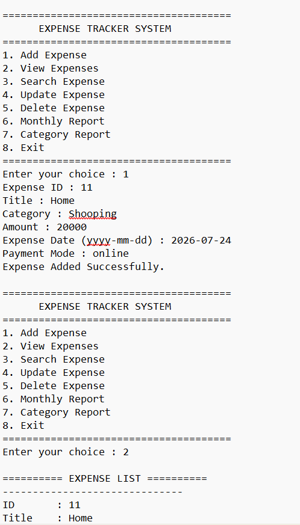
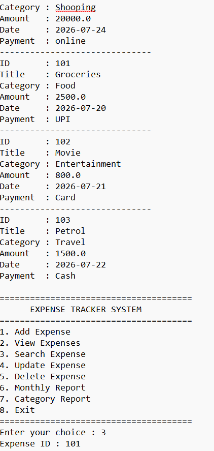
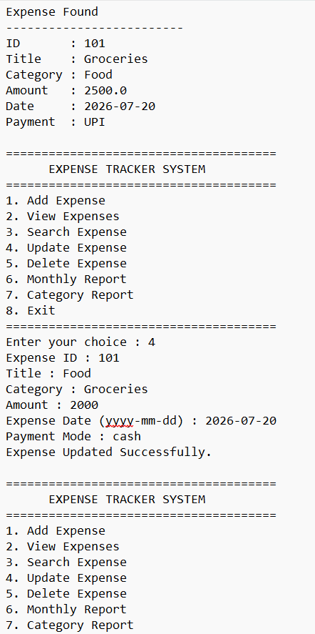
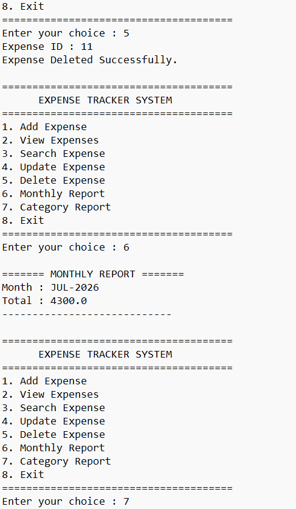
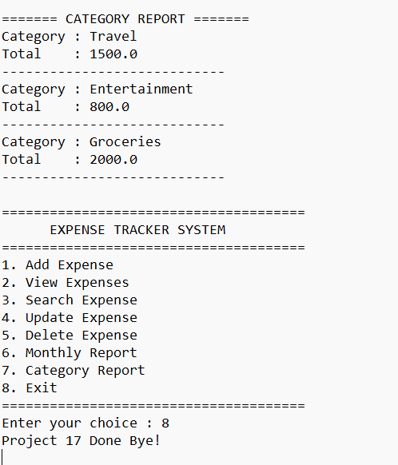

# 💰 Project 17 | Expense Tracker System | Java + Oracle 11g |

> **Day 17 of 102 Java Projects Challenge — Building Enterprise Java Applications with JDBC & Oracle Database**


A complete **Console-Based Expense Tracker System** developed using **Core Java, JDBC, Maven, and Oracle Database 11g XE**.

This project demonstrates enterprise Java development concepts including **DAO Pattern, JDBC PreparedStatement, Oracle SQL, CRUD Operations, Report Generation, and Layered Architecture**.

---

# 📸 Application Demo







---

# 🚀 Features

| Feature | Description |
|----------|-------------|
| ✅ Add Expense | Store new expenses into Oracle Database |
| ✅ View Expenses | Display all recorded expenses |
| ✅ Search Expense | Find an expense using Expense ID |
| ✅ Update Expense | Modify existing expense details |
| ✅ Delete Expense | Remove an expense record |
| ✅ Monthly Report | Calculate total monthly expenses |
| ✅ Category Report | Display category-wise expense totals |
| ✅ JDBC Connectivity | Oracle Database integration using JDBC |
| ✅ DAO Pattern | Clean layered architecture |

---

# 🛠 Tech Stack

- ☕ Java 21
- 🗄 Oracle Database 11g XE
- 🔌 JDBC
- 📦 Apache Maven
- 💻 Eclipse IDE
- 🌿 Git
- 🐙 GitHub

---

# 📂 Project Structure

```
17-expense-tracker-cli
│
├── screenshots
│   ├── demo1.png
│   ├── demo2.png
│   ├── demo3.png
│   ├── demo4.png
│   ├── demo5.png
│   ├── demo6.png
│   ├── demo7.png
│   └── demo8.png
│
├── src
│   └── main
│       └── java
│           └── com
│               └── raviteja
│                   └── expense
│                       ├── dao
│                       ├── model
│                       ├── service
│                       ├── util
│                       └── main
│
├── schema.sql
├── pom.xml
├── README.md
└── .gitignore
```

---

# 🗃 Database Schema

```sql
CREATE TABLE EXPENSES(
    EXPENSE_ID NUMBER PRIMARY KEY,
    TITLE VARCHAR2(100),
    CATEGORY VARCHAR2(50),
    AMOUNT NUMBER(10,2),
    EXPENSE_DATE DATE,
    PAYMENT_MODE VARCHAR2(30)
);
```

---

# 🧠 Concepts Practiced

- Object-Oriented Programming
- JDBC API
- Oracle Database
- SQL CRUD Operations
- PreparedStatement
- DAO Design Pattern
- Layered Architecture
- Collections (ArrayList)
- Exception Handling
- Report Generation
- Maven Project Structure

---

# ▶️ How to Run

1. Clone the repository

```bash
git clone https://github.com/YOUR_USERNAME/17-expense-tracker-cli.git
```

2. Open the project in Eclipse.

3. Configure Oracle JDBC Driver.

4. Create the EXPENSES table using `schema.sql`.

5. Update the database credentials in `DBConnection.java`.

6. Run

```
ExpenseTrackerApp.java
```

---

# 🎯 Learning Outcomes

✔ Java JDBC Programming

✔ Oracle Database Integration

✔ CRUD Operations

✔ Report Generation

✔ DAO Pattern

✔ Maven Project Setup

✔ Console Application Development

---

⭐ If you found this project useful, don't forget to star the repository.
